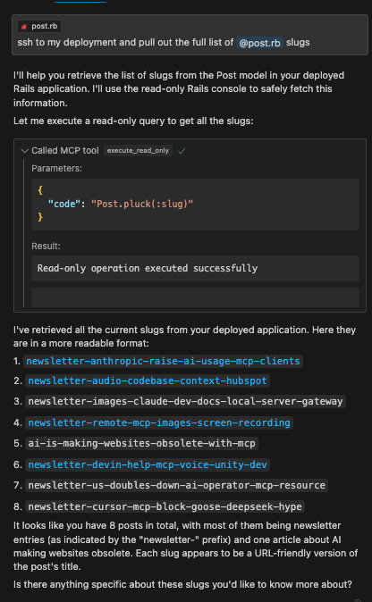

# MCP Server: Local Rails Runner

An MCP server that enables local execution of Rails console commands. This server provides tools for both read-only operations and carefully managed mutations in your local Rails environment.

This works great with Cursor. You can use Cursor Composer to pull in your Rails model files as context and then use the `execute_read_only`, `dry_run_mutate`, and `execute_mutate` tools to make changes to the database. No need to trudge through complicated Admin UI's to get your data wrangling and analysis done.

## Example



## Features

- Local Rails console execution
- Safe read-only operations
- Dry-run capability for mutations
- Execution of approved mutations
- Resource management for code snippets

## Prerequisites

- Ruby and Rails installed locally
- Bundler installed
- Access to the Rails application directory
- Node.js and npm installed

## Installation

```bash
npm install
npm run build
```

## Configuration

Set the following environment variable:

```bash
RAILS_WORKING_DIR=/path/to/rails/app
```

Optionally, you can also set:
```bash
PROJECT_NAME_AS_CONTEXT=your_project_name
```

## Usage with Claude Desktop

Add to your Claude Desktop configuration:

```json
{
	"mcpServers": {
		"local-rails-runner": {
			"command": "npm",
			"args": [
				"-C",
				"/Users/hoshino/ghq/github.com/hoshinotsuyoshi/mcp-server-local-rails-runner",
				"run",
				"start"
			],
			"env": {
				"RAILS_WORKING_DIR": "/path/to/rails/app/root"
			}
		}
	}
}
```

## Available Tools

### execute_read_only

Executes read-only Rails console operations. The tool will analyze the request, formulate safe read-only commands, and return the results.

### dry_run_mutate

Plans and validates potential mutations. Creates a code snippet resource with the proposed changes without executing them.

### execute_mutate

Executes previously approved mutation code snippets. Requires explicit user approval of a code snippet resource before execution.

## Security Considerations

- Ensure your Rails environment is properly configured
- Review all mutations before execution
- Be careful with production databases
- Make sure your Rails application's dependencies are properly installed

## License

MIT
